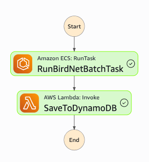

pip install birdnet (Python version <= 3.11)

## AWS
### 1. Step function 
BirdNetAnalysisWorkflow


### 2. debug
```bash
aws logs describe-log-streams \                                                   
  --log-group-name /ecs/birdnet-task-definition \
  --order-by LastEventTime \                                                     
  --descending \
  --max-items 3
```
```bash
aws logs get-log-events \
  --log-group-name /ecs/birdnet-task-definition \
  --log-stream-name <LogID>
 ````
